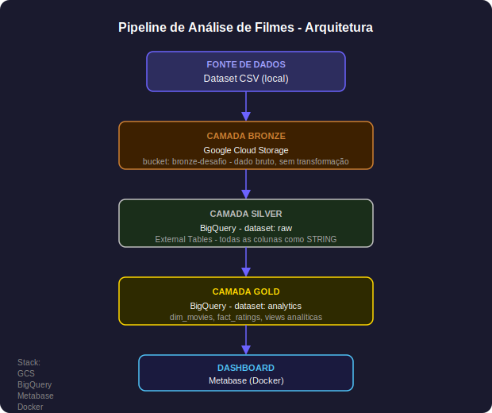
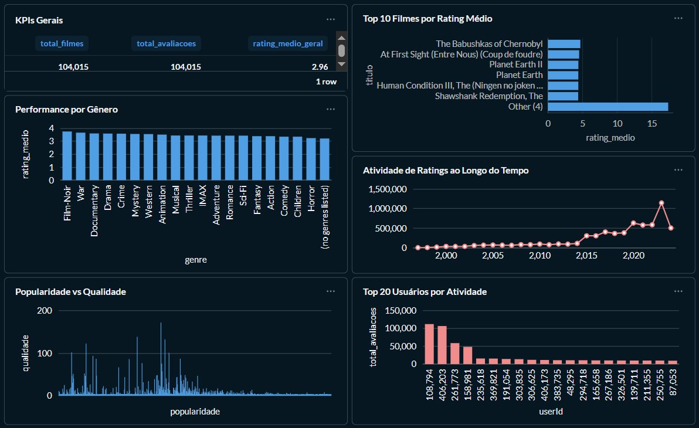

# Pipeline de Análise de Filmes - Desafio Técnico

Pipeline de engenharia de dados para análise de comportamento de usuários em uma plataforma de recomendação de filmes, seguindo a Medallion Architecture (Bronze, Silver e Gold) no GCP.

---

## Problema

O objetivo foi responder perguntas de negócio como:

- Quais filmes têm o melhor rating médio com volume relevante de avaliações?
- Quais gêneros são mais bem avaliados pelos usuários?
- Como a atividade de avaliações evoluiu ao longo dos anos?
- Quais usuários são mais engajados na plataforma?
- Existe correlação entre popularidade e qualidade percebida?

---

## Fonte de Dados

Dataset público de recomendação de filmes com 6 arquivos CSV totalizando mais de 500 MB de dados de avaliações, histórico de usuários e catálogo de filmes.

| Arquivo | Tamanho | Descrição |
|---|---|---|
| `movies.csv` | 5 MB | Catálogo de filmes com título e gêneros |
| `user_rating_history.csv` | 77 MB | Histórico de avaliações dos usuários |
| `ratings_for_additional_users.csv` | 157 MB | Avaliações de usuários adicionais |
| `belief_data.csv` | 213 MB | Dados de crenças e predições do sistema |
| `movie_elicitation_set.csv` | 2.7 MB | Conjunto de elicitação de filmes |
| `user_recommendation_history.csv` | 50 MB | Histórico de recomendações |

---

## Arquitetura



**Camada Bronze (GCS)**
Arquivos CSV brutos armazenados no bucket `bronze-desafio`, sem nenhuma transformação. Representa a fonte da verdade, com os dados exatamente como chegaram.

**Camada Silver (BigQuery, dataset: raw)**
External tables apontando para os CSVs no GCS. Todas as colunas definidas como STRING para evitar erros de parsing com NULLs, timestamps e inconsistências. Nenhuma transformação aplicada.

**Camada Gold (BigQuery, dataset: analytics)**
Tabelas e views com dados transformados, tipados corretamente e modelados para consumo analítico. É aqui que acontece a limpeza, tipagem e criação das métricas de negócio.

---

## Stack

- Google Cloud Storage (GCS): armazenamento dos arquivos CSV (camada Bronze)
- BigQuery: external tables, modelagem analítica, queries SQL e criação de views
- Metabase: ferramenta de Business Intelligence para criação de gráficos e dashboards
- Docker: utilizado para subir o Metabase localmente
- SQL (BigQuery SQL): limpeza de dados, modelagem analítica, criação de tabelas, views e métricas do dashboard

---

## Passos de Execução

**1. Upload dos dados para o GCS**
Upload manual dos 6 arquivos CSV para o bucket `bronze-desafio` no Google Cloud Storage.

**2. Criar dataset raw no BigQuery**
```sql
CREATE SCHEMA `desafio-tecnico-01.raw`;
```

**3. Criar External Tables (todas as colunas como STRING)**
```sql
CREATE OR REPLACE EXTERNAL TABLE `desafio-tecnico-01.raw.movies`
(
  movieId STRING,
  title   STRING,
  genres  STRING
)
OPTIONS (
  format                = 'CSV',
  uris                  = ['gs://bronze-desafio/movies.csv'],
  skip_leading_rows     = 1,
  field_delimiter       = ',',
  allow_quoted_newlines = true,
  allow_jagged_rows     = true
);
```
Repetir para: `belief_data`, `movie_elicitation_set`, `ratings_for_additional_users`, `user_rating_history`, `user_recommendation_history`.

**4. Criar dataset analytics**
```sql
CREATE SCHEMA `desafio-tecnico-01.analytics`;
```

**5. Criar tabelas analíticas**
Ver seção de queries principais abaixo.

**6. Subir Metabase via Docker**
```bash
docker run -d -p 3000:3000 --name metabase metabase/metabase
```
Acessar em `http://localhost:3000`.

**7. Conectar Metabase ao BigQuery**
- Tipo: BigQuery
- Project ID: `desafio-tecnico-01`
- Service Account JSON com permissões: `BigQuery Data Viewer`, `BigQuery Job User`, `BigQuery Metadata Viewer`
- Dataset: `analytics`

**8. Sincronizar schema e criar dashboard**
Admin > Databases > Sync database schema now.

---

## Queries Principais

### dim_movies
```sql
CREATE OR REPLACE TABLE `desafio-tecnico-01.analytics.dim_movies` AS
SELECT
  CAST(movieId AS INT64)                                  AS movieId,
  REGEXP_EXTRACT(title, r'^(.*)\s\(\d{4}\)$')            AS titulo,
  CAST(REGEXP_EXTRACT(title, r'\((\d{4})\)$') AS INT64)  AS ano_lancamento,
  genres                                                  AS generos
FROM `desafio-tecnico-01.raw.movies`
WHERE movieId IS NOT NULL
  AND REGEXP_CONTAINS(title, r'\(\d{4}\)$');
```

### fact_ratings
```sql
CREATE OR REPLACE TABLE `desafio-tecnico-01.analytics.fact_ratings` AS
SELECT
  SAFE_CAST(userId  AS INT64)                             AS userId,
  SAFE_CAST(movieId AS INT64)                             AS movieId,
  SAFE_CAST(rating  AS FLOAT64)                          AS rating,
  SAFE.PARSE_TIMESTAMP('%Y-%m-%d %H:%M:%S', tstamp)      AS rated_at
FROM `desafio-tecnico-01.raw.user_rating_history`

UNION ALL

SELECT
  SAFE_CAST(userId  AS INT64),
  SAFE_CAST(movieId AS INT64),
  SAFE_CAST(rating  AS FLOAT64),
  SAFE.PARSE_TIMESTAMP('%Y-%m-%d %H:%M:%S', tstamp)
FROM `desafio-tecnico-01.raw.ratings_for_additional_users`;
```

### Views analíticas
```sql
-- Top 10 filmes por rating médio
CREATE OR REPLACE VIEW `desafio-tecnico-01.analytics.vw_top_movies` AS
SELECT
  m.titulo, m.generos, m.ano_lancamento,
  ROUND(AVG(CASE WHEN r.rating > 0 THEN r.rating END), 2) AS rating_medio,
  COUNT(r.rating) AS total_avaliacoes
FROM `desafio-tecnico-01.analytics.dim_movies` m
JOIN `desafio-tecnico-01.analytics.fact_ratings` r ON m.movieId = r.movieId
GROUP BY m.titulo, m.generos, m.ano_lancamento
HAVING total_avaliacoes >= 50
ORDER BY rating_medio DESC
LIMIT 10;

-- Performance por gênero
CREATE OR REPLACE VIEW `desafio-tecnico-01.analytics.vw_genre_performance` AS
SELECT
  genre,
  COUNT(*) AS total_avaliacoes,
  ROUND(AVG(CASE WHEN r.rating > 0 THEN r.rating END), 2) AS rating_medio
FROM `desafio-tecnico-01.analytics.dim_movies` m
JOIN `desafio-tecnico-01.analytics.fact_ratings` r ON m.movieId = r.movieId,
UNNEST(SPLIT(m.generos, '|')) AS genre
GROUP BY genre
ORDER BY rating_medio DESC;

-- Heatmap de atividade
CREATE OR REPLACE VIEW `desafio-tecnico-01.analytics.vw_ratings_heatmap` AS
SELECT
  EXTRACT(YEAR  FROM rated_at) AS ano,
  EXTRACT(MONTH FROM rated_at) AS mes,
  COUNT(*) AS total_avaliacoes,
  ROUND(AVG(CASE WHEN rating > 0 THEN rating END), 2) AS rating_medio
FROM `desafio-tecnico-01.analytics.fact_ratings`
WHERE rated_at IS NOT NULL
GROUP BY ano, mes;
```

---

## Dashboard

O dashboard foi construído no Metabase com 6 visualizações alimentadas pelas views analíticas:

| Gráfico | Tipo | View |
|---|---|---|
| KPIs Gerais | Tabela | `vw_movie_kpis` |
| Top 10 Filmes por Rating Médio | Barra horizontal | `vw_top_movies` |
| Performance por Gênero | Barra vertical | `vw_genre_performance` |
| Atividade de Ratings ao Longo do Tempo | Linha | `vw_ratings_heatmap` |
| Popularidade vs Qualidade | Scatter | `vw_scatter_popularity_vs_quality` |
| Top 20 Usuários por Atividade | Barra vertical | `vw_user_activity` |



---

## Conclusões

A análise do dataset revelou padrões interessantes sobre o comportamento dos usuários e a qualidade percebida dos filmes.

**Filmes mais bem avaliados:** Os títulos com maior rating médio são majoritariamente documentários e minisséries, como The Babushkas of Chernobyl, Planet Earth e Band of Brothers. Usuários que buscam conteúdo de nicho tendem a ser mais engajados e avaliam com notas mais altas, elevando a média desses títulos acima dos blockbusters populares.

**Gêneros:** Film-Noir e War lideram em rating médio, enquanto Comedy e Action ficam nas últimas posições. O padrão reforça que qualidade percebida e popularidade não andam juntas, e o scatter plot de popularidade vs qualidade confirma isso visualmente.

**Evolução temporal:** A atividade de avaliações cresceu de forma consistente entre 2000 e 2023, com um pico expressivo por volta de 2022-2023, indicando crescimento acelerado da base de usuários ou expansão do catálogo da plataforma nesse período.

**Perfil dos usuários:** A distribuição de atividade é altamente concentrada. Poucos usuários respondem pela maior parte das avaliações, padrão típico de plataformas de recomendação onde um grupo de heavy users sustenta a qualidade e o volume dos dados de rating.

**Decisão técnica:** Definir todas as colunas como STRING na camada Silver foi essencial. O dataset continha timestamps em formatos inconsistentes e valores nulos em campos numéricos que teriam quebrado a ingestão com tipagem automática. O tratamento de tipos foi feito apenas na camada Gold, com SAFE_CAST e PARSE_TIMESTAMP.

---

## Autor

Luciendel Alves  
Analista de Risco e PLD  
LinkedIn: https://www.linkedin.com/in/luciendelalves